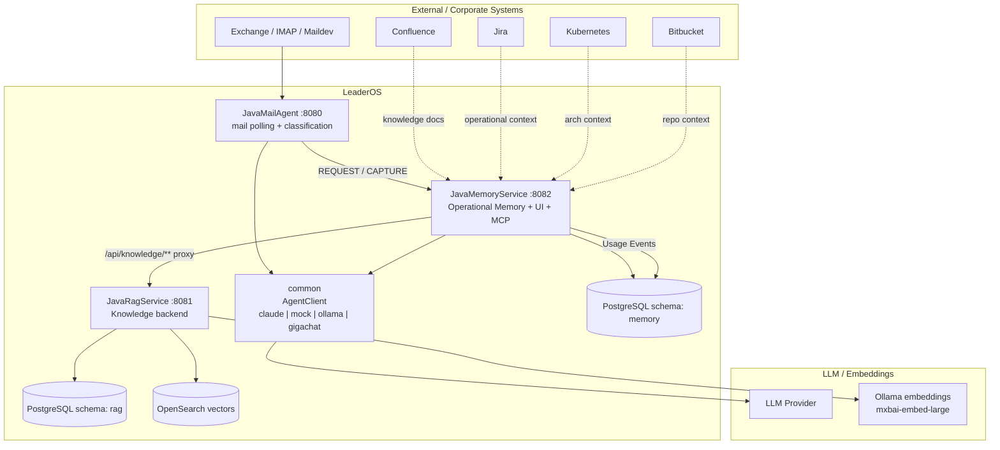

# CR-ARCH-006: Update LeaderOS presentation architecture diagrams

**Дата:** 2026-06-20  
**Статус:** Draft  
**Сервис:** ARCH / JavaMemoryService  
**Issue:** #9  
**Файл:** `JavaMemoryService/src/main/resources/static/presentation.html`

## Проблема / Мотивация

Текущая HTML-презентация LeaderOS содержит устаревшие Mermaid-схемы и формулировки.

Основные проблемы:

1. В схемах и тексте местами зашито `Claude AI` / `Claude-агент`, хотя в презентации должен использоваться vendor-neutral образ `AI-Agent`, а актуальная архитектура уже использует общий `common` модуль и `AgentClient` с провайдерами:
   - `claude`
   - `mock`
   - `ollama`
   - `gigachat`
2. Архитектурный слайд недостаточно явно показывает роль `common` как единой LLM-инфраструктуры.
3. `JavaMemoryService` должен быть показан как центральный gateway для:
   - задач;
   - captures;
   - рисков;
   - людей;
   - usage statistics;
   - knowledge UI/API.
4. `JavaRagService` должен быть показан как внутренний knowledge backend, а не как сервис, к которому UI ходит напрямую.
5. Схемы визуально мелкие и недостаточно центрированы для демонстрации в fullscreen-режиме.

## Решение

Обновить `JavaMemoryService/src/main/resources/static/presentation.html` точечно, без полного редизайна всей презентации.

Нужно:

1. Актуализировать Mermaid-схему архитектуры.
2. Актуализировать scenario flow-схемы, если они напрямую ссылаются на Claude вместо vendor-neutral `AI-Agent` / `AgentClient`.
3. Сделать Mermaid-схемы крупнее.
4. Центрировать все Mermaid-схемы по горизонтали и вертикали.
5. Убрать или уменьшить боковые панели, если они мешают крупному отображению диаграммы.
6. Обновить wording: `Claude AI` / `Claude-агент` → `AI-Agent` / `LLM Provider` / `AgentClient`, где это архитектурно корректно.
7. Заменить в подписях и flow-диаграммах `claude --print` на `agent --print`, если речь идёт о batch CLI-точке входа, а не о конкретной реализации провайдера.

## Архитектурная модель, которую нужно отразить



## Изменения в API

Нет новых backend API.

Но презентация должна корректно показывать существующие API:

| Endpoint | Роль |
|----------|------|
| `POST /api/tasks/pending` | Mail Agent создаёт PENDING задачи в Memory Service |
| `POST /api/capture` | Capture Bot сохраняет raw заметки |
| `POST /api/knowledge/search` | Memory-owned proxy к RAG search + usage events |
| `GET/PUT/POST /api/knowledge/documents/**` | Browser-facing proxy управления RAG-документами |
| `GET /api/stats/usage?period=...` | Usage Statistics |
| `GET /ui/stats` | UI статистики использования и saved time |
| `GET /ui/knowledge` | Knowledge Gateway UI |

## Изменения в схеме БД

Нет.

Но на схеме нужно отразить текущую изоляцию PostgreSQL-схем:

```text
leader_framework
├── mailagent  ← JavaMailAgent
├── memory     ← JavaMemoryService
└── rag        ← JavaRagService
```

Важно: `JavaMemoryService` не должен получать прямой JDBC-доступ к `rag` schema. Работа с RAG идёт через REST proxy `/api/knowledge/**`.

## Зависимости

Документы-источники:

- `ARCHITECTURE.md`
- `README.md`
- `PROJECT-INSTRUCTION.md`

Кодовый файл:

- `JavaMemoryService/src/main/resources/static/presentation.html`

## Acceptance Criteria

- [ ] Обновлён файл `JavaMemoryService/src/main/resources/static/presentation.html`.
- [ ] Архитектурный слайд отражает актуальные модули: `JavaMailAgent`, `JavaMemoryService`, `JavaRagService`, `common`.
- [ ] На схеме показан `common AgentClient` и провайдеры `claude | mock | ollama | gigachat`.
- [ ] На схеме `JavaMemoryService` показан как основной gateway для operational memory и knowledge UI/API.
- [ ] На схеме `JavaRagService` показан как внутренний semantic knowledge backend.
- [ ] На схеме видно, что knowledge UI/API идут через Memory Service `/api/knowledge/**`.
- [ ] Убраны устаревшие формулировки `Claude AI` / `Claude-агент` там, где нужен vendor-neutral `AI-Agent` / `LLM Provider`.
- [ ] Во всех flow-схемах `claude --print` заменён на `agent --print`, если показана generic CLI-интеграция агента.
- [ ] Scenario-схемы не создают впечатление, что сервисы напрямую завязаны только на Claude; вместо этого показан `AI-Agent`.
- [ ] Mermaid-схемы стали крупнее и читаются в fullscreen.
- [ ] Все Mermaid-схемы расположены по центру экрана.
- [ ] Презентация остаётся standalone static HTML.
- [ ] Нет ошибок Mermaid в browser console.

## UX / Styling требования

1. Все Mermaid-схемы должны занимать большую часть полезной области соответствующего слайда.
2. Рекомендуемые настройки:
   - `fontSize: 15px` или `16px`;
   - `max-width: 90vw` для SVG;
   - `max-height: calc(100vh - 180px)` для архитектурного слайда;
   - `display:flex; align-items:center; justify-content:center` для wrapper.
3. Если боковая колонка на любом слайде со схемой делает диаграмму слишком маленькой — убрать колонку или перенести её в подпись под схемой.
4. Не ломать навигацию презентации:
   - стрелки клавиатуры;
   - touch swipe;
   - fullscreen по `F`.

## Как тестировать

1. Запустить сервис локально:

```bash
cd JavaMemoryService
mvn spring-boot:run
```

или через общий runner:

```bash
./test-runner/build.sh
./test-runner/start-services.sh --profile local
```

2. Открыть презентацию:

```text
http://localhost:8082/presentation.html
```

3. Проверить:
   - все слайды открываются;
   - Mermaid-схемы рендерятся;
   - архитектурный слайд читается без увеличения браузера;
   - все схемы центрированы;
   - browser console не содержит Mermaid parse/render errors;
   - нет устаревшего текста `Claude AI` / `Claude-агент` в местах, где должен быть vendor-neutral `AI-Agent`;
   - нет `claude --print` в местах, где должен быть generic CLI-вызов `agent --print`.

4. Проверить diff:

```bash
git diff JavaMemoryService/src/main/resources/static/presentation.html
```

## Задача для Codex / локального агента

1. Прочитать этот CR.
2. Прочитать `ARCHITECTURE.md` и `README.md`.
3. Открыть `JavaMemoryService/src/main/resources/static/presentation.html`.
4. Обновить Mermaid-схемы и стили согласно Acceptance Criteria.
5. Проверить HTML вручную в браузере или через smoke-check.
6. Приложить в отчёт:
   - какие слайды изменены;
   - какие устаревшие формулировки заменены;
   - как проверялся Mermaid render.

## Связанный GitHub Issue

- #9 — Implement CR-ARCH-006 Update LeaderOS presentation architecture diagrams
