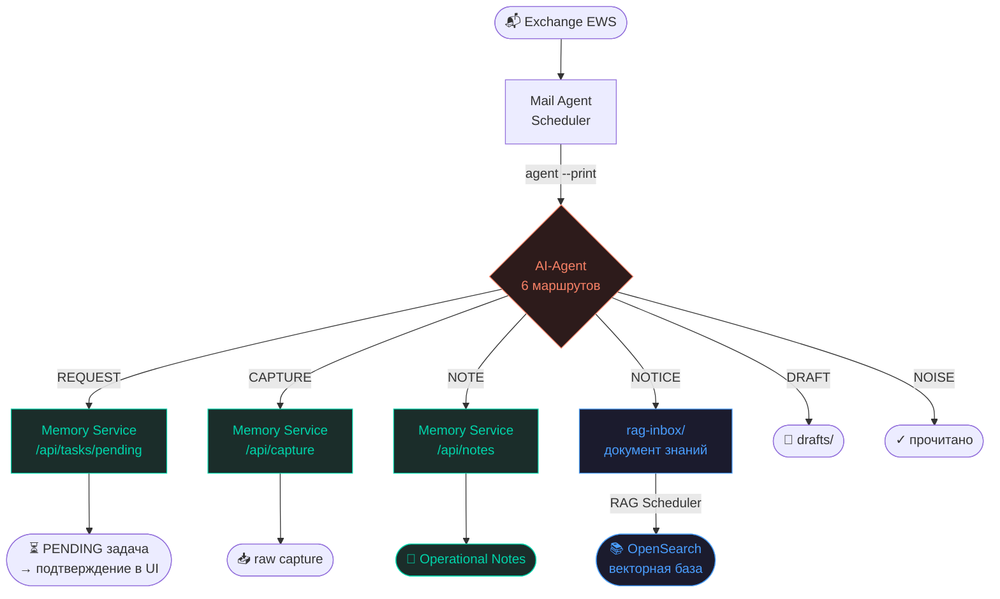

# 2026-06-28_CR-PRES-006-slide-6-note-notice-split

**Дата:** 2026-06-28  
**Статус:** Draft  
**Сервис:** PRES  
**Область:** Presentation / Slide 6  
**Файлы:**  
- `PRESENTATION.md`
- `presentation.html`
- при необходимости: `docs/cr/presentation/presentation-vNext.html`

---

## Проблема / Мотивация

На слайде 6 презентации сейчас показан сценарий:

> `Письмо → Задача · Знания`

В текущей диаграмме Mail Agent классифицирует письмо в 5 маршрутов:

- `REQUEST`
- `CAPTURE`
- `NOTICE`
- `DRAFT`
- `NOISE`

Но актуальная архитектура Mail Agent уже содержит отдельный маршрут:

- `NOTE`

Из-за этого на слайде отсутствует один путь обработки письма, а также смешиваются две разные сущности:

| Тип | Назначение | Хранилище |
|-----|------------|-----------|
| `NOTE` | Операционная заметка, нужна в ежедневной работе техлида | Memory Service `/api/notes` |
| `NOTICE` | Долговременное знание из письма | `rag-inbox/` → RAG Scheduler → OpenSearch |

Сейчас слайд визуально не показывает различие между оперативной памятью и долговременной базой знаний.

---

## Решение

Обновить слайд 6 так, чтобы Mail Agent показывал 6 маршрутов:

```text
REQUEST
CAPTURE
NOTE
NOTICE
DRAFT
NOISE
```

Разделить `NOTE` и `NOTICE` визуально и семантически:

- `NOTE` вести в `Memory Service /api/notes` и далее в `Operational Notes`
- `NOTICE` вести в `rag-inbox/`, далее в `RAG Scheduler`, далее в `OpenSearch`

---

## Изменения в PRESENTATION.md

### Текущий заголовок

Можно оставить:

```markdown
### Слайд 6 — Сценарий 1: Письмо → Задача · Знания
```

Либо уточнить:

```markdown
### Слайд 6 — Сценарий 1: Письмо → Задача · Заметка · Знания
```

### Обновить Flow

Заменить текущий блок Flow на:

```markdown
**Flow:**
```text
📬 Exchange EWS
    → Mail Agent Scheduler
    → AI-Agent (6 маршрутов):
        REQUEST  → Memory Service /api/tasks/pending  → PENDING задача → подтверждение в UI
        CAPTURE  → Memory Service /api/capture         → raw capture
        NOTE     → Memory Service /api/notes           → Operational Notes
        NOTICE   → rag-inbox/                          → RAG Scheduler → OpenSearch
        DRAFT    → drafts/
        NOISE    → ✓ прочитано
```
```

### Обновить результат

Заменить текущий результат:

```markdown
**Результат:** 5 маршрутов — каждое письмо попадает куда надо.
```

на:

```markdown
**Результат:** 6 маршрутов — задача, capture, операционная заметка, знание в RAG, черновик или шум. Каждое письмо автоматически попадает в нужное хранилище.
```

---

## Изменения в presentation.html

Найти слайд:

```html
<!-- 6. СЦЕНАРИЙ 1 -->
```

### 1. Обновить title

Текущий вариант:

```html
<div class="title">📧 Письмо → Задача · Знания</div>
```

Рекомендуемый вариант:

```html
<div class="title">📧 Письмо → Задача · Заметка · Знания</div>
```

Если не помещается на слайде, допустимо оставить текущий заголовок.

---

### 2. Обновить result text

Текущий текст:

```html
<div class="result-text">5 маршрутов: задача, заметка, знание в RAG, черновик или шум — каждое письмо попадает куда надо.</div>
```

Заменить на:

```html
<div class="result-text">6 маршрутов: задача, capture, операционная заметка, знание в RAG, черновик или шум — каждое письмо попадает в нужное хранилище.</div>
```

---

### 3. Обновить Mermaid diagram

Текущая диаграмма содержит 5 веток от `AI-Agent`.

Заменить Mermaid-блок слайда 6 на:



---

## Визуальные требования

1. `NOTE` и `NOTICE` должны быть разными ветками.
2. `NOTE` должен быть визуально связан с Memory Service / Operational Memory.
3. `NOTICE` должен быть визуально связан с RAG / Knowledge / OpenSearch.
4. Желательно использовать разные цвета:
   - `NOTE` / `Memory Service` — зелёный цвет оперативной памяти.
   - `NOTICE` / `RAG` / `OpenSearch` — синий цвет knowledge layer.
5. Диаграмма должна оставаться читаемой на экране 16:9.
6. Если диаграмма становится перегруженной, разрешается:
   - уменьшить подписи у конечных узлов;
   - оставить `raw capture`, `Operational Notes`, `OpenSearch` как короткие финальные блоки;
   - слегка уменьшить font-size Mermaid только для слайда 6.

---

## Изменения в API

Нет.

Используются уже существующие маршруты:

| Тип | Endpoint / storage |
|-----|--------------------|
| `REQUEST` | `POST /api/tasks/pending` |
| `CAPTURE` | `POST /api/capture` |
| `NOTE` | `POST /api/notes` |
| `NOTICE` | `rag-inbox/` → RAG Scheduler |
| `DRAFT` | `drafts/` |
| `NOISE` | mark as read |

---

## Изменения в схеме БД

Нет.

---

## Зависимости

- Актуальная архитектура Mail Agent уже должна поддерживать `NOTE`.
- `PRESENTATION.md` должен оставаться source-of-truth для структуры презентации.
- `presentation.html` должен соответствовать обновлённому описанию слайда 6.

---

## Как тестировать

### 1. Проверка Markdown

Открыть `PRESENTATION.md` и убедиться, что в описании слайда 6 указаны 6 маршрутов:

```text
REQUEST
CAPTURE
NOTE
NOTICE
DRAFT
NOISE
```

### 2. Проверка HTML

Открыть `presentation.html` в браузере.

Перейти на слайд 6.

Проверить:

- заголовок не обрезается;
- диаграмма помещается на экран;
- видны обе ветки:
  - `NOTE → Memory Service /api/notes → Operational Notes`
  - `NOTICE → rag-inbox → RAG Scheduler → OpenSearch`
- текст результата говорит про 6 маршрутов.

### 3. Mermaid validation

Проверить, что Mermaid diagram рендерится без ошибки.

### 4. Визуальная проверка

Слайд должен объяснять ключевую разницу:

```text
NOTE   = оперативная память техлида
NOTICE = долговременное знание для RAG
```

---

## Acceptance Criteria

- [ ] В `PRESENTATION.md` слайд 6 описывает 6 маршрутов Mail Agent.
- [ ] В `presentation.html` слайд 6 отображает отдельную ветку `NOTE`.
- [ ] `NOTE` ведёт в `Memory Service /api/notes`.
- [ ] `NOTICE` ведёт в `rag-inbox/ → RAG Scheduler → OpenSearch`.
- [ ] Подпись результата говорит про 6 маршрутов, а не про 5.
- [ ] Диаграмма визуально читаема и не выходит за пределы слайда.
- [ ] `NOTE` и `NOTICE` визуально различимы как разные уровни памяти.
- [ ] Презентация открывается в браузере без ошибок Mermaid.
