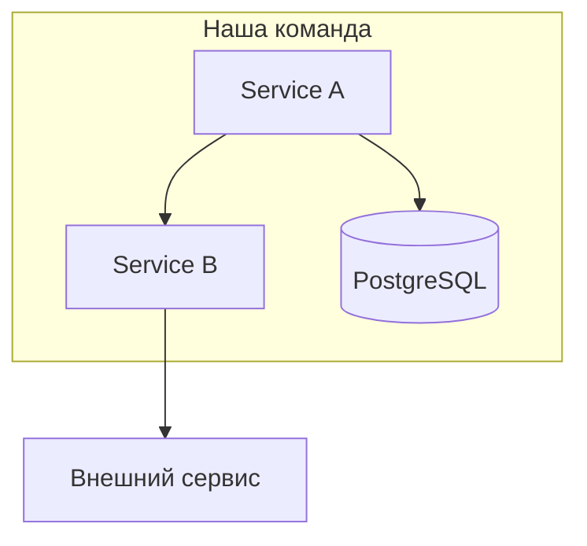

# Скилл: arch-mapper

## Когда использовать

Когда нужно понять архитектуру системы из документации, кода или описания.

---

## Промпт

Используй следующий алгоритм для построения карты архитектуры:

**Шаг 1. Сбор данных**
Если доступен Confluence MCP — прочитай все страницы со словами: архитектура, сервис, интеграция, схема, API.
Если доступен GitHub MCP — прочитай README всех репозиториев команды.
Если данных нет — попроси меня описать систему словами.

**Шаг 2. Извлечение**
Из всех источников извлеки:
- Названия всех сервисов
- Технологический стек каждого сервиса
- Кто кого вызывает (синхронно / асинхронно)
- Внешние зависимости (БД, очереди, внешние API)
- Single Points of Failure (где всё упадёт если это упадёт)

**Шаг 3. Построй карту**

Mermaid C4-диаграмма:

**Шаг 4. Таблица сервисов**

| Сервис | Назначение | Стек | Критичность | Документация |
|--------|------------|------|-------------|--------------|
| ... | ... | Java/Spring | HIGH | ✅/❌ |

**Шаг 5. Риски архитектуры**

- Что не задокументировано
- Где нет тестов
- Где ручные операции
- Устаревшие компоненты

**Сохрани результат** в `./workspace/01_services/architecture-map.md`
