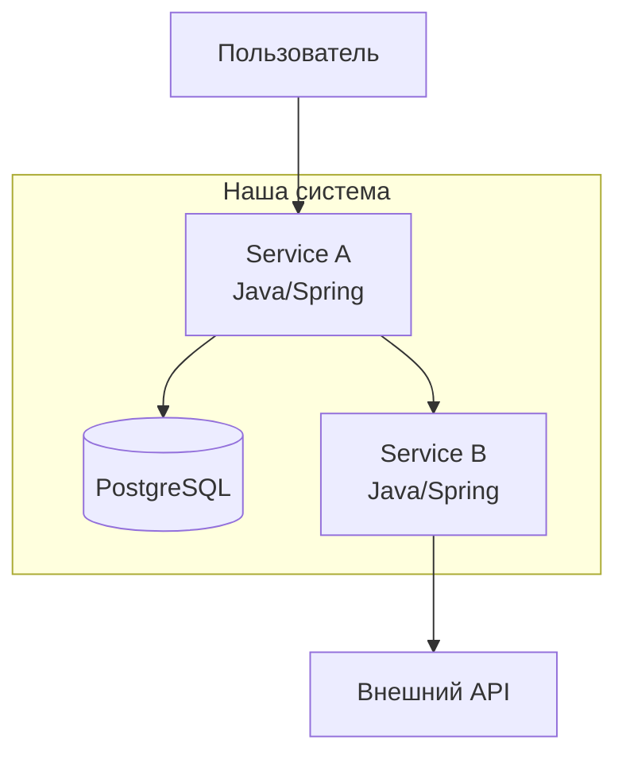

# C4 Диаграммы

C4 Model — четыре уровня детализации архитектуры.

| Уровень | Файл | Описание |
|---------|------|----------|
| L1 Context | `context.md` | Система и внешние пользователи/системы |
| L2 Container | `containers.md` | Сервисы, БД, очереди внутри системы |
| L3 Component | `component-[service].md` | Компоненты внутри сервиса |

## Шаблон (Mermaid)

