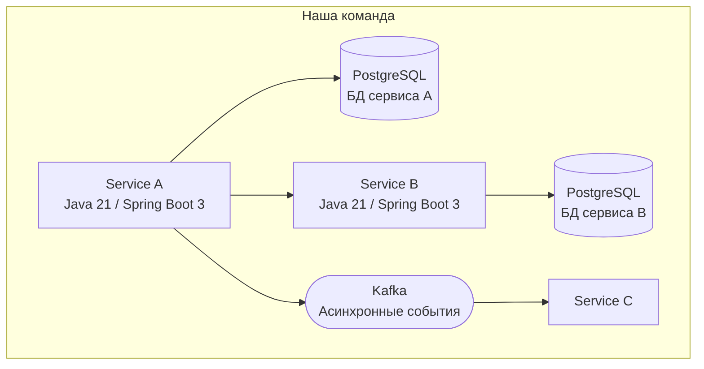

# L2: Containers

> Заполни после запуска arch-analyst или вручную

## Диаграмма сервисов

## Реестр сервисов

| Сервис | Назначение | Стек | Репозиторий | Критичность | Документация |
|--------|------------|------|-------------|-------------|--------------|
| [Название] | [Что делает] | Java 21/Spring | [ссылка] | HIGH/MED/LOW | ✅/❌ |

## Хранилища данных

| БД/Хранилище | Тип | Использует | Данные |
|--------------|-----|------------|--------|
| [Название] | PostgreSQL/Kafka/Redis | [Сервисы] | [Что хранит] |

## Single Points of Failure

- [ ] [Компонент] — [почему критично]

---
*Обновлено: [дата]*
