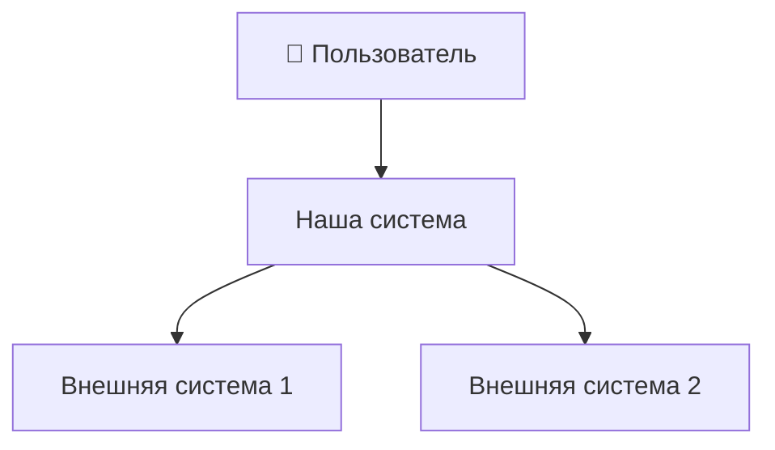

# L1: System Context

> Заполни после запуска arch-analyst или вручную

## Описание системы

[Что делает система, для кого, зачем]

## Диаграмма

## Внешние пользователи

| Тип | Описание |
|-----|----------|
| [Роль] | [Что делает с системой] |

## Внешние системы

| Система | Назначение | Протокол |
|---------|------------|----------|
| [Название] | [Зачем] | REST/gRPC/MQ |

---
*Обновлено: [дата]*
