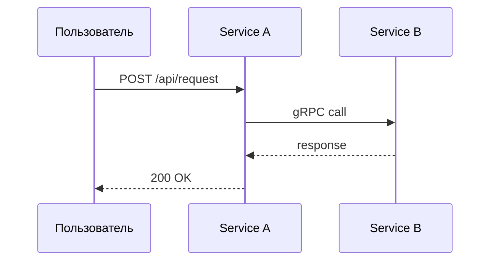
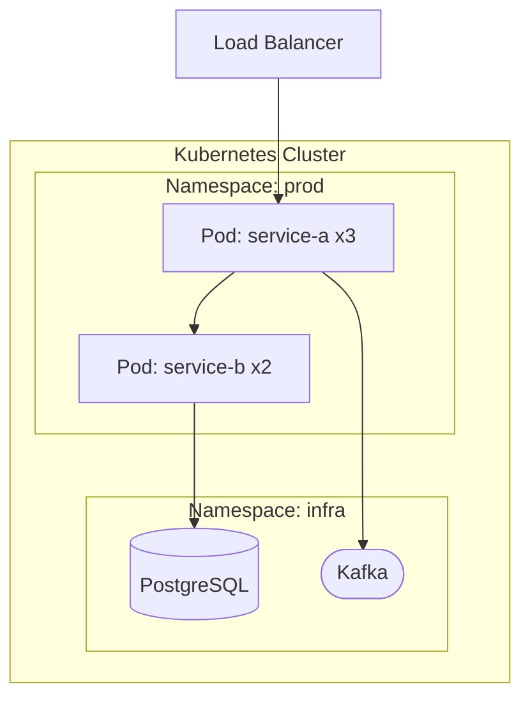

# Схемы и диаграммы

Здесь хранятся схемы которые не вписываются в C4 модель.

## Типы диаграмм

| Папка/Файл | Что содержит |
|------------|-------------|
| `data-flows/` | Потоки данных между сервисами |
| `sequence/` | Sequence диаграммы для сложных сценариев |
| `deployment/` | Схемы деплоя (Kubernetes, окружения) |

## Шаблоны

### Sequence диаграмма (Mermaid)

### Deployment диаграмма (Mermaid)

